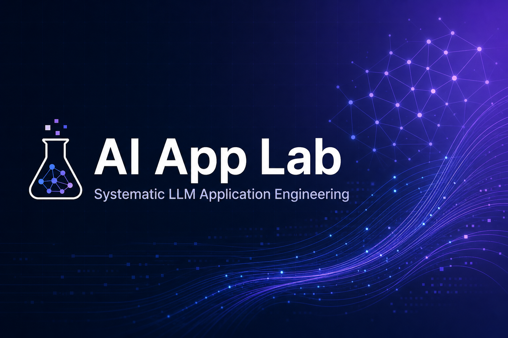

<div align="center">

<!-- Banner -->


<br />

<!-- Capsule header -->


<br />

<!-- Badges -->
[](https://github.com/ZrbJava/ai-app-lab/stargazers)
[](./LICENSE)
[](./LEARNING_PLAN.md)
[](https://nextjs.org)
[](./LEARNING_PLAN.md)

<br />

<!-- Star trend -->
<a href="https://star-history.com/#ZrbJava/ai-app-lab&Date">
  <picture>
    <source media="(prefers-color-scheme: dark)" srcset="https://api.star-history.com/svg?repos=ZrbJava/ai-app-lab&type=Date&theme=dark" />
    <source media="(prefers-color-scheme: light)" srcset="https://api.star-history.com/svg?repos=ZrbJava/ai-app-lab&type=Date" />
    
  </picture>
</a>

<br />

**读开源 · 做实验 · 写笔记 · 构建 AI 应用开发完整能力**

[开始学习](./LEARNING_PLAN.md) · [Lab 01](./labs/01-minimal-chat/) · [概念笔记](./docs/00-glossary.md) · [参考项目](./references/vercel-ai-sdk.md)

</div>

---

## 关于本仓库

系统学习 **AI 应用开发** 的实验仓库：从最小 Chat 到 Agent、RAG、异步视频与 Docker 私有化。

> 开源参考项目 clone 到仓库外（`~/oss/`），本仓库只放 **实验代码 + 结构化笔记 + 12 周路线图**。

<table>
<tr>
<td width="50%">

### 你将学到

- 流式 SSE / Vercel AI SDK
- Tool Calling & Agent 状态机
- BYOK 多 Provider 配置
- RAG 检索增强生成
- 异步媒体任务 & Docker 部署

</td>
<td width="50%">

### 学习路径

```
Lab 01-03  基础 Chat & 流式
Lab 04-06  工程化 & 鉴权
Lab 07-09  Agent & RAG
Lab 10-12  多模态 & 产品整合
```

[查看完整计划 →](./LEARNING_PLAN.md)

</td>
</tr>
</table>

---

## 学习看板

在下方勾选进度（也可使用 GitHub Issues / Projects 跟踪）。

### 阶段一 · 基础 `Week 1-3`

- [ ] [Lab 01](./labs/01-minimal-chat/) — 最小 Chat API
- [ ] [Lab 02](./labs/02-ai-sdk-stream/) — AI SDK 流式 SSE
- [ ] [Lab 03](./labs/03-multi-provider/) — 多 Provider / Ollama

### 阶段二 · 工程化 `Week 4-6`

- [ ] [Lab 04](./labs/04-tool-calling/) — Tool Calling
- [ ] [Lab 05](./labs/05-session-persistence/) — 会话持久化
- [ ] [Lab 06](./labs/06-auth-byok/) — 登录 + BYOK 密钥

### 阶段三 · Agent `Week 7-9`

- [ ] [Lab 07](./labs/07-agent-state-machine/) — Agent 状态机
- [ ] [Lab 08](./labs/08-artifact-stream/) — Artifact 事件流 UI
- [ ] [Lab 09](./labs/09-rag-basics/) — RAG 检索增强

### 阶段四 · 产品化 `Week 10-12`

- [ ] [Lab 10](./labs/10-async-media-job/) — 异步视频/媒体任务
- [ ] [Lab 11](./labs/11-docker-deploy/) — Docker 私有化部署
- [ ] [Lab 12](./labs/12-mini-navos/) — Mini Navos 整合项目

<details>
<summary><b>概念自评表（点击展开）</b></summary>

| 概念 | 自评 | 对应 Lab | 笔记 |
|------|:----:|----------|------|
| HTTP / SSE 流式 | | 01, 02 | [docs/01-streaming.md](./docs/01-streaming.md) |
| Provider / BYOK | | 03, 06 | [docs/02-providers.md](./docs/02-providers.md) |
| Tool Calling | | 04 | [docs/03-tool-calling.md](./docs/03-tool-calling.md) |
| 会话与消息模型 | | 05 | [docs/04-sessions.md](./docs/04-sessions.md) |
| Agent / 状态机 | | 07, 08 | [docs/05-agents.md](./docs/05-agents.md) |
| RAG | | 09 | [docs/06-rag.md](./docs/06-rag.md) |
| 异步任务队列 | | 10 | [docs/07-async-jobs.md](./docs/07-async-jobs.md) |
| Docker 自托管 | | 11 | [docs/08-docker.md](./docs/08-docker.md) |

</details>

---

## 仓库结构

```
ai-app-lab/
├── assets/                # Banner 等资源
├── docs/                  # 跨 Lab 概念笔记
├── references/            # 开源项目阅读笔记
├── labs/01 … 12/          # 动手实验（各自独立）
├── scripts/               # clone-references / new-lab
├── LEARNING_PLAN.md       # 12 周详细计划
└── README.md
```

---

## 快速开始

```bash
git clone https://github.com/ZrbJava/ai-app-lab.git
cd ai-app-lab

# 克隆参考开源项目到 ~/oss（可选）
./scripts/clone-references.sh

# 本地 LLM（Lab 03 起）
ollama pull qwen2.5:7b

# 开始第一个实验
cd labs/01-minimal-chat
# 见 labs/01-minimal-chat/README.md
```

---

## 学习四步循环

| 步骤 | 动作 | 位置 |
|:----:|------|------|
| 1 | 读概念 | `docs/` |
| 2 | 读开源 | `references/` + `~/oss/` |
| 3 | 写代码 | `labs/xx/` |
| 4 | 写复盘 | Lab `README.md` |

---

## 参考开源项目

| 项目 | 用途 | 笔记 |
|------|------|------|
| [vercel/ai](https://github.com/vercel/ai) | AI SDK、流式、Tools | [notes](./references/vercel-ai-sdk.md) |
| [NextChat](https://github.com/ChatGPTNextWeb/ChatGPT-Next-Web) | 最小 Chat | [notes](./references/nextchat.md) |
| [LiteLLM](https://github.com/BerriAI/litellm) | 模型网关 | [notes](./references/litellm.md) |
| [LibreChat](https://github.com/danny-avila/LibreChat) | BYOK + Docker | [notes](./references/librechat.md) |
| [LangGraph.js](https://github.com/langchain-ai/langgraphjs) | Agent 图 | [notes](./references/langgraph.md) |
| [Dify](https://github.com/langgenius/dify) | 平台 / RAG | [notes](./references/dify.md) |
| [Lobe Chat](https://github.com/lobehub/lobe-chat) | Chat UI | [notes](./references/lobe-chat.md) |
| [RAGFlow](https://github.com/infiniflow/ragflow) | RAG 工程 | [notes](./references/ragflow.md) |

---

<div align="center">


**MIT License** · Built for learning · [LEARNING_PLAN](./LEARNING_PLAN.md)

</div>
