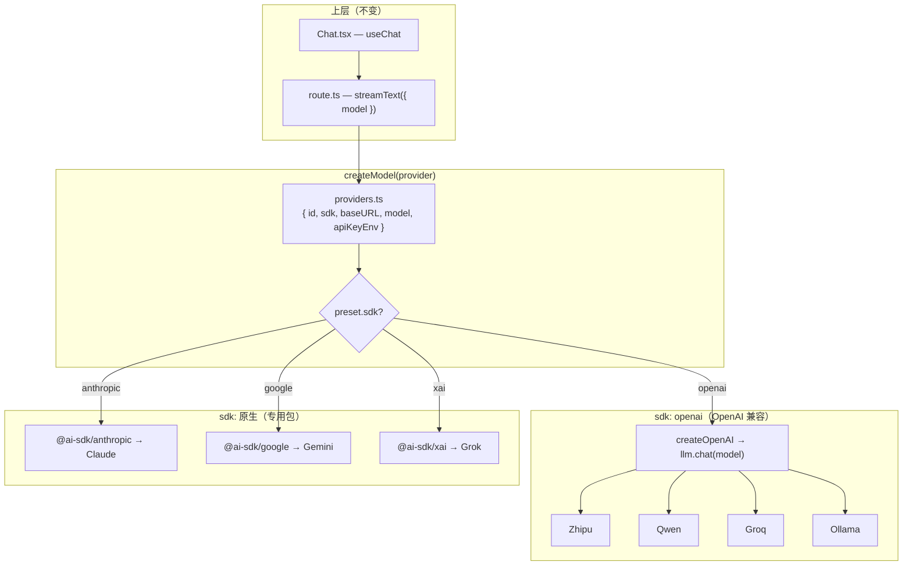

# 02 — Provider 与 BYOK

> 状态：✅ Lab 03 已完成 · Lab 06 将深入 BYOK 加密存储

## 要解决什么问题

同一应用支持多家模型；用户 **自配 Key**，平台不代付。换 Provider 不应改业务代码，只改配置。

## 核心概念

| 概念 | 一句话 |
|------|--------|
| **OpenAI-compatible** | 各家厂商提供与 OpenAI 相同格式的 HTTP API（`/chat/completions`） |
| **Provider** | 模型供应商：智谱、千问、Groq、Ollama 等 |
| **baseURL + apiKey + model** | 切换 Provider 的三个核心参数 |
| **Provider 工厂** | `createModel()` 根据配置创建 model 实例，业务代码无感 |
| **BYOK** | Bring Your Own Key，用户自带 API Key（Lab 06 做加密存储） |

## Lab 03 实现的 Provider

| Provider | baseURL | 默认模型 | Key 环境变量 |
|----------|---------|----------|--------------|
| 智谱 GLM | `https://open.bigmodel.cn/api/paas/v4` | `glm-4-flash` | `ZHIPU_API_KEY` |
| 通义千问 | `https://dashscope.aliyuncs.com/compatible-mode/v1` | `qwen-plus` | `DASHSCOPE_API_KEY` |
| Groq | `https://api.groq.com/openai/v1` | `llama-3.1-8b-instant` | `GROQ_API_KEY` |
| Ollama | `http://localhost:11434/v1` | `qwen2.5:7b` | `OLLAMA_API_KEY`（默认 `ollama`） |

## 关键问题（学完后能回答）

### 1. 如何用一套接口接 Ollama 和 OpenAI？

**答案：OpenAI 兼容层 + Provider 工厂。**

```
业务代码: streamText({ model: createModel(provider).model })
                ↓
工厂:     createOpenAI({ baseURL, apiKey }) → llm.chat(modelId)
                ↓
各家 API: 都是 POST /chat/completions + stream: true
```

- AI SDK 的 `@ai-sdk/openai` 不只是接 OpenAI，任何 **OpenAI 兼容** 的 API 都能用，只需改 `baseURL`
- 必须用 `llm.chat(model)`，不能用 `llm(model)`（后者走 Responses API，仅 OpenAI 官方支持）
- 每家 baseURL 格式不同：
  - 智谱：`/api/paas/v4`（无 `/v1`）
  - 千问/Ollama/Groq：`/v1` 或 `/compatible-mode/v1`

### 2. API Key 为什么不能放前端？

| 放前端 | 放服务端 `.env.local` |
|--------|----------------------|
| 任何人 DevTools 都能看到 | 只在 Node.js 运行时读取 |
| 可被爬取、盗用、产生费用 | 不暴露给浏览器 |
| 无法轮换、审计 | 可按环境隔离（dev/prod） |

Lab 03 做法：

- 前端只传 `provider: 'zhipu'`（标识选哪家）
- 服务端 `createModel(provider)` 读 `ZHIPU_API_KEY` 等环境变量
- Key 通过 `Authorization: Bearer xxx` 发给 LLM，**绝不经过客户端**

### 3. Provider 工厂模式怎么设计？

```typescript
// lib/providers.ts — 预设表（配置数据）
PROVIDER_PRESETS = [{ id, baseURL, defaultModel, apiKeyEnv }, ...]

// lib/ai.ts — 工厂（创建逻辑）
function createModel(providerId?) {
  const preset = getProviderPreset(providerId)
  const llm = createOpenAI({ baseURL: preset.baseURL, apiKey: resolveApiKey(preset) })
  return llm.chat(preset.defaultModel)
}

// route.ts — 消费方（无 Provider 细节）
const { model } = createModel(provider)
streamText({ model, messages })
```

**好处：**

- 加新 Provider 只改 `providers.ts` 一行预设
- `route.ts` / `Chat.tsx` 不用动
- 预设表与 Key 解析逻辑分离，易测试

### 工厂分支图（扩展 Anthropic / Gemini / Grok）



| 类型 | 包 | 厂商 | Lab 03 |
|------|-----|------|--------|
| OpenAI 兼容 | `@ai-sdk/openai` | 智谱、千问、Groq、Ollama | ✅ |
| 原生 SDK | `@ai-sdk/anthropic` | Claude | 扩展 |
| 原生 SDK | `@ai-sdk/google` | Gemini | 扩展 |
| 原生 SDK | `@ai-sdk/xai` | Grok | 扩展 |

## 两种切换方式（Lab 03）

**方式 A — UI 下拉：** `sendMessage({ text }, { body: { provider } })`

**方式 B — 纯 .env：** 设置 `LLM_BASE_URL` + `LLM_API_KEY` + `LLM_MODEL`，不传 `provider`

## 与 LiteLLM 的对比

| | Lab 03（AI SDK 工厂） | LiteLLM（代理网关） |
|---|---|---|
| 架构 | 应用内工厂函数 | 独立代理服务 |
| 切换方式 | 改 env 或 UI | 改 model 字符串 `litellm.completion(model="groq/...")` |
| 适用场景 | 学习型小应用 | 生产环境 100+ 模型统一网关 |
| fallback | 需自己实现 | 内置路由和 fallback |

## 验收清单

- [x] UI 下拉切换智谱 / 千问 / Groq
- [x] 改 `.env` 的 `LLM_*` 三行可切换 Provider
- [ ] Ollama 本地（需 `ollama serve` + `ollama pull qwen2.5:7b`）

## 我的笔记

（学习过程中自行追加）
