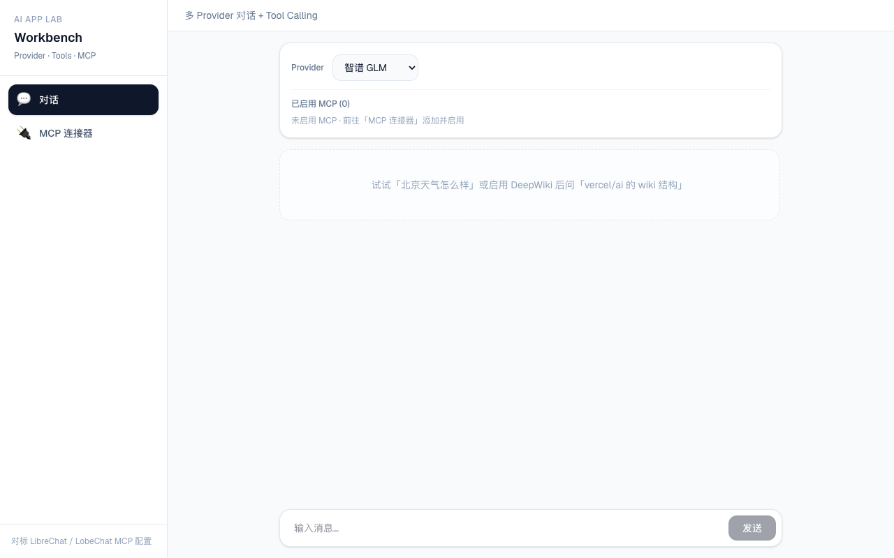

# 03 — Tool Calling

> 状态：✅ Lab 04 已完成

## 要解决什么问题

让 LLM **查实时数据、调 API**，而不只靠训练记忆。

## 核心概念

| 概念 | 一句话 |
|------|--------|
| **tool schema** | `name` + `description` + `inputSchema`，告诉模型有哪些函数 |
| **tool_call** | 模型决定调用哪个 tool、传什么参数 |
| **tool_result** | 服务端 `execute` 函数，把结果回注给模型 |
| **多步循环** | `stopWhen: stepCountIs(N)` 控制「调 tool → 再生成」最多几轮 |

## Lab 04 实现的 Tools

| Tool | 参数 | 用途 |
|------|------|------|
| `getWeather` | `city: string` | mock 查询城市天气 |
| `calc` | `expression: string` | 安全计算数学表达式 |

## 关键问题（学完后能回答）

### 1. 何时用 Tool，何时用 RAG？

| | Tool Calling | RAG |
|---|---|---|
| 数据特点 | 结构化、可 API 查询 | 非结构化文档、知识库 |
| 例子 | 查天气、算数、发邮件 | 查公司手册、论文摘要 |
| 实时性 | 每次调用拿最新数据 | 依赖索引更新频率 |

**口诀：** 能写成函数调用的用 Tool；需要从文档里「找答案」的用 RAG。两者可组合。

### 2. 多 tool 一次调用怎么处理？

AI SDK 自动处理：

1. 模型可能一次返回多个 `tool_call`
2. SDK 并行/顺序 `execute` 各 tool
3. 把所有 `tool_result` 塞回 messages，进入下一步
4. 直到 `stopWhen` 触发或模型不再调 tool

```typescript
const result = streamText({
  model,
  tools: { getWeather, calc },
  stopWhen: stepCountIs(5), // 最多 5 轮
  messages,
})
```

### 3. tool 执行失败如何反馈给模型？

在 `execute` 里 `throw new Error('...')`，SDK 会把错误作为 `tool_result` 的 error 传给模型，模型可据此重试或向用户解释。

UI 侧 `part.state === 'output-error'` 可展示 `part.errorText`。

## 代码模式（AI SDK v7）

```typescript
import { tool, stepCountIs, streamText } from 'ai'
import { z } from 'zod'

const tools = {
  getWeather: tool({
    description: '查询城市天气',
    inputSchema: z.object({ city: z.string() }),
    execute: async ({ city }) => ({ city, temp: 18, condition: '晴' }),
  }),
}

streamText({
  model,
  tools,
  stopWhen: stepCountIs(5),
  messages,
})
```

**注意：** v7 用 `inputSchema` 不是 `parameters`；用 `stepCountIs` 不是 `maxSteps`。

## 验收清单

- [x] `getWeather` + `calc` 两个 mock tool
- [x] `stopWhen: stepCountIs(5)` 多步循环
- [x] UI 展示工具调用状态（`isToolUIPart`）

## Lab 04 Demo 界面



MCP 连接器配置见 [Lab 04 MCP 笔记](../labs/04-tool-calling/notes/mcp-servers.md#界面预览)。

## 我的笔记

- [Lab 04 链路笔记](../labs/04-tool-calling/notes/tool-calling-flow.md)
