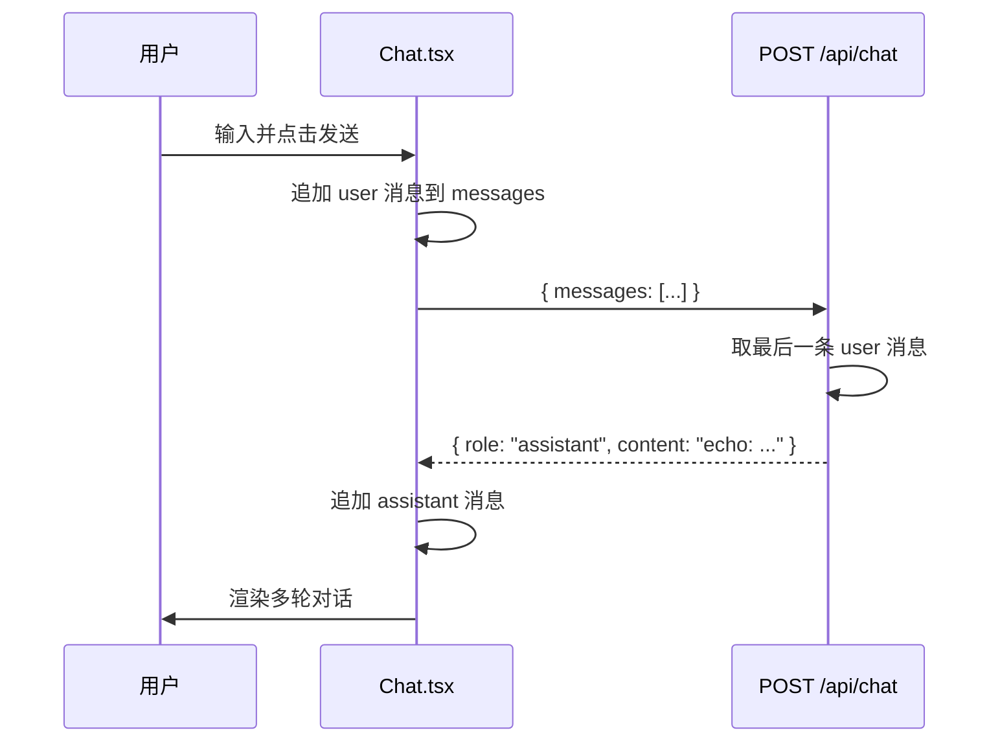

# Lab 01 请求链路

## 时序图

## 核心文件

| 文件 | 职责 |
|------|------|
| `demo/src/types/chat.ts` | `Message` 类型定义 |
| `demo/src/components/Chat.tsx` | 前端 state + UI + fetch |
| `demo/src/app/api/chat/route.ts` | Echo API，模拟后端 |

## 和 NextChat 的对应

| NextChat | Lab 01 |
|----------|--------|
| `useChatStore` + `session.messages` | `useState<Message[]>` |
| `onUserInput()` | `handleSend()` |
| `api.llm.chat({ messages })` | `fetch('/api/chat')` |
| `app/api/openai.ts` | `app/api/chat/route.ts` |

## 踩坑记录

- `create-next-app` 不能在含 `README.md` 的 lab 根目录直接初始化，项目在 `demo/` 子目录
- 发送时要把**完整 messages 历史**带给 API，才能支持多轮对话
- `Chat.tsx` 需要 `"use client"`，因为用到了 `useState`
