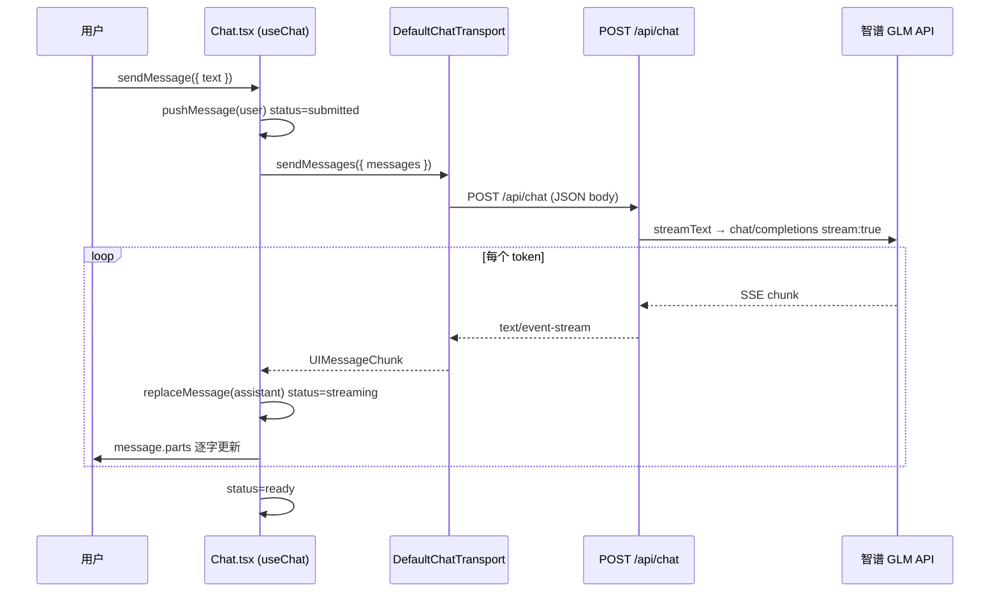

# Lab 02 流式请求链路

## 时序图



## 核心文件

| 文件 | 职责 |
|------|------|
| `demo/src/lib/ai.ts` | 智谱 Provider 配置（OpenAI 兼容） |
| `demo/src/app/api/chat/route.ts` | `streamText` + SSE 响应 |
| `demo/src/components/Chat.tsx` | `useChat` 流式 UI |

## 和 Lab 01 的变化

| Lab 01 | Lab 02 |
|--------|--------|
| `NextResponse.json(reply)` | `createUIMessageStreamResponse` |
| `await res.json()` | `useChat` 自动消费 SSE |
| `message.content` | `message.parts`（AI SDK v6+） |
| 假 echo | 真实智谱 GLM 模型 |
| 手写 `useState` + `fetch` | `useChat` + `useSyncExternalStore` |

## status 状态机

```
ready → submitted → streaming → ready
                  ↘ error ↗
```

| status | 含义 |
|--------|------|
| `ready` | 空闲，可发送 |
| `submitted` | 已 POST，等待首字节 |
| `streaming` | 正在收 token |
| `error` | 请求失败 |

## 验收步骤

1. `pnpm dev` 启动后发送消息，观察逐字渲染
2. DevTools → Network → `POST /api/chat`
3. 确认 Response Headers：`content-type: text/event-stream`
4. 查看 EventStream 标签页，有 `text-delta` 事件

## 踩坑记录

- AI SDK v6+ 前端用 `@ai-sdk/react` 的 `useChat`，不是手写 fetch
- 渲染消息用 `message.parts`，不是 `message.content`
- loading 状态用 `status === 'streaming' || status === 'submitted'`
- 智谱 baseURL 是 `/api/paas/v4`，不是 `/v1`；API Key 放 `.env.local`，不要提交到 git
- AI SDK v7 默认走 `/v1/responses`，兼容接口要用 `llm.chat(model)` 而非 `llm(model)`
- 改 `.env.local` 后需重启 `pnpm dev` 才能生效
