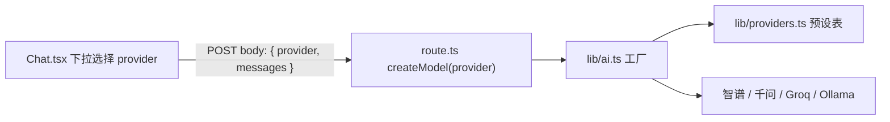
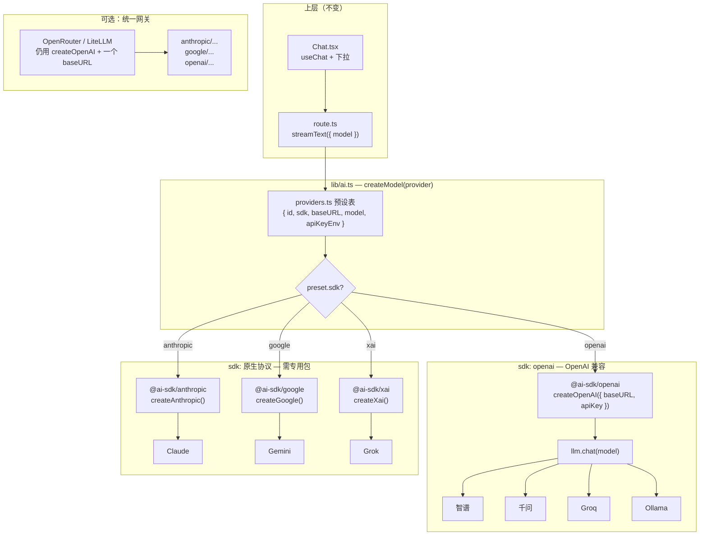

# Lab 03 Provider 切换链路

## 请求链路



## Provider 工厂分支（OpenAI 兼容 vs 原生 SDK）

Lab 03 目前只用 `@ai-sdk/openai`（OpenAI **兼容**插头）。扩展 Anthropic / Gemini / Grok 时，工厂按 `sdk` 字段分支，**上层 `streamText` / `useChat` 不变**：



### 两类插头对照

| 类型 | npm 包 | 典型厂商 | Lab 03 |
|------|--------|----------|--------|
| **OpenAI 兼容** | `@ai-sdk/openai` | 智谱、千问、Groq、Ollama | ✅ 已实现 |
| **原生 SDK** | `@ai-sdk/anthropic` | Claude | 🔜 扩展 |
| **原生 SDK** | `@ai-sdk/google` | Gemini | 🔜 扩展 |
| **原生 SDK** | `@ai-sdk/xai` | Grok | 🔜 扩展 |
| **统一网关** | `@ai-sdk/openai` + 代理 baseURL | OpenRouter、LiteLLM | 可选 |

## 两种切换方式

### 方式 A：UI 下拉（默认）

- 前端 `sendMessage({ text }, { body: { provider } })`
- 服务端 `createModel(provider)` 读预设表 + `ZHIPU_API_KEY` 等环境变量
- API Key **只在服务端**，不传给浏览器

### 方式 B：纯 .env 切换

设置 `LLM_BASE_URL` + `LLM_API_KEY` + `LLM_MODEL`，请求不带 `provider`：

```bash
# 换 Provider 只改这三行，重启 pnpm dev
LLM_BASE_URL=http://localhost:11434/v1
LLM_API_KEY=ollama
LLM_MODEL=qwen2.5:7b
```

## 核心文件

| 文件 | 职责 |
|------|------|
| `lib/providers.ts` | Provider 预设表（智谱、千问、Ollama、Groq） |
| `lib/ai.ts` | `createModel()` 工厂 |
| `route.ts` | 从 body 取 `provider`，调用工厂 |
| `Chat.tsx` | Provider 下拉 + `sendMessage` 传 body |

## 踩坑记录

- OpenAI 兼容接口统一用 `llm.chat(model)`，不要用 `llm(model)`
- Ollama baseURL 是 `http://localhost:11434/v1`（带 `/v1`）
- 智谱 baseURL 是 `https://open.bigmodel.cn/api/paas/v4`（不是 `/v1`）
- 千问 baseURL 是 `https://dashscope.aliyuncs.com/compatible-mode/v1`，Key 环境变量 `DASHSCOPE_API_KEY`
- API Key 绝不能放前端或 commit 到 git
- `ZHIPU_API_KEY` 不能留中文占位符（如 `你的智谱API_KEY`），会触发 ByteString 报错；应填真实 Key，或与 `LLM_API_KEY` 保持一致
