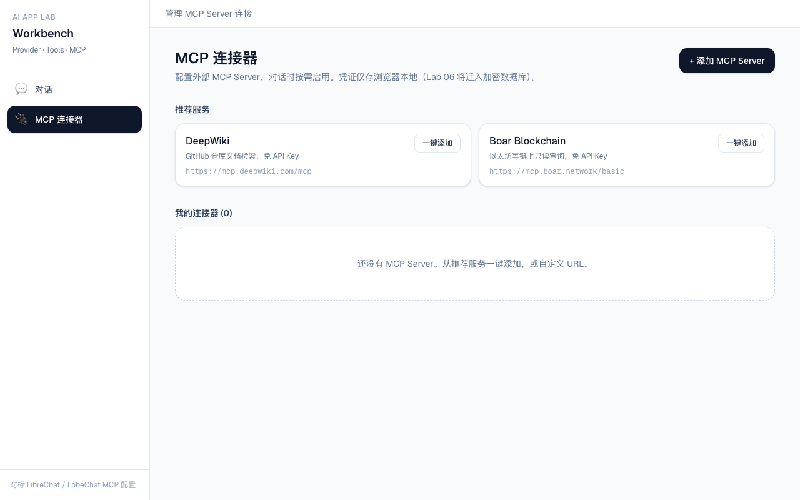
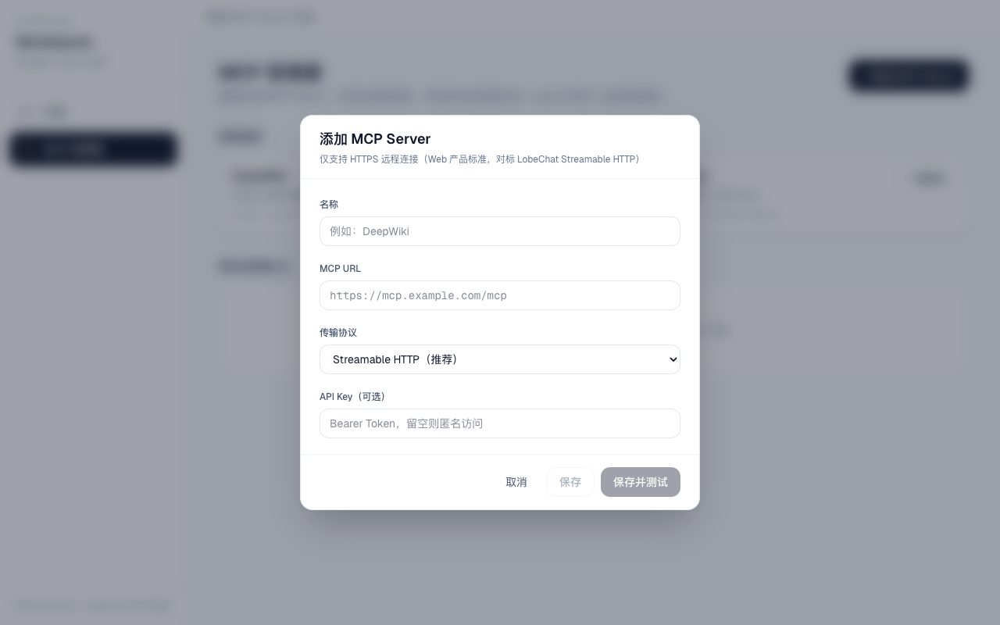

# Lab 04 — Tool Calling

| 项 | 内容 |
|----|------|
| **阶段** | 二 · 工程化 |
| **预计** | 第 4 周 · 6～10 小时 |
| **状态** | ✅ 已完成 |

## 目标

LLM **调用工具函数**，基于返回结果生成最终答案。

## 参考

- [references/vercel-ai-sdk.md](../../references/vercel-ai-sdk.md) — tools 章节
- [docs/03-tool-calling.md](../../docs/03-tool-calling.md)
- [notes/tool-calling-flow.md](./notes/tool-calling-flow.md)
- [notes/mcp-servers.md](./notes/mcp-servers.md) — 已实测的 MCP Server 清单

## 交付清单

- [x] 定义 2 个 tool：`getWeather(city)`、`calc(expression)`（mock）
- [x] AI SDK `tools` + `stopWhen: stepCountIs(5)`
- [x] UI 展示「正在调用工具 xxx」
- [x] （扩展）用户可配置 MCP Server（Workbench UI + 测试连接）

## MCP 配置（企业级 UI）

- 侧边栏：**对话** / **MCP 连接器**
- 推荐 DeepWiki、Boar 一键添加；支持自定义 HTTPS URL
- 详见 [notes/mcp-servers.md](./notes/mcp-servers.md)

### 界面截图

| 对话页 | MCP 设置页 | 添加 Server |
|--------|-----------|-------------|
|  |  |  |

## 依赖

- Lab 03

## 初始化

```bash
cd labs/04-tool-calling/demo
pnpm install
cp .env.local.example .env.local   # 或从 Lab 03 复制已有 .env.local
pnpm dev
```

## 通过标准

- [x] 问「北京天气」会触发 getWeather
- [x] 最终回答包含 tool 返回的数据
- [x] 更新 [docs/03-tool-calling.md](../../docs/03-tool-calling.md)

## 复盘

### 懂了什么

- Tool = `description` + `inputSchema` + `execute`，模型根据 schema 决定何时调用
- `stopWhen: stepCountIs(5)` 开启多步循环：调 tool → 拿结果 → 继续生成
- 默认只跑 1 步，有 tool 时必须显式设置 `stopWhen`
- UI 用 `isToolUIPart` + `getToolName` 渲染 `tool-getWeather` 等 part

### 还不懂什么

- 生产环境 tool 权限审批（`toolApproval`）流程
- 复杂 Agent 用 `ToolLoopAgent` 与手写 `streamText` 的取舍

### 下一步

→ [Lab 05 — 会话持久化](../05-session-persistence/)
