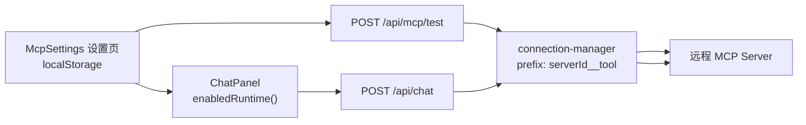

# MCP Server 配置（企业级 UI）

> 对标 LibreChat user-tier MCP + LobeChat Plugin 配置面板

## 界面预览

### 对话页（Workbench）

侧边栏切换 **对话** / **MCP 连接器**，对话区展示 Provider 与已启用 MCP 状态。


### MCP 连接器设置页

推荐服务一键添加、我的连接器列表、测试连接与启用开关。


### 添加自定义 MCP Server

仅支持 HTTPS 远程连接（Streamable HTTP / SSE），可选 API Key。


> 重新截图：`cd demo && node scripts/capture-screenshots.mjs`（需先 `pnpm dev`）

## 产品能力

- **侧边栏导航**：对话 / MCP 连接器（Workbench 布局）
- **推荐服务**：DeepWiki、Boar 一键添加（对标 LobeChat 市场）
- **自定义 Server**：名称、HTTPS URL、传输协议、可选 API Key
- **测试连接**：`POST /api/mcp/test` 列出 tools 数量
- **对话启用**：Chat 页展示已启用 MCP chips，请求时动态合并 tools
- **安全**：仅 HTTPS、禁内网 SSRF（`lib/mcp/url-validator.ts`）

## 架构



## 核心文件

| 文件 | 职责 |
|------|------|
| `lib/mcp/types.ts` | 配置类型 |
| `lib/mcp/catalog.ts` | 运营推荐列表 |
| `lib/mcp/connection-manager.ts` | 建连、合并 tools、关闭 |
| `hooks/useMcpServers.ts` | 本地配置 CRUD |
| `components/mcp/McpSettings.tsx` | 设置页 |
| `app/api/mcp/test/route.ts` | 测试连接 API |

## 与 LibreChat 对照

| LibreChat | 本 Demo（当前） | Lab 06 计划 |
|-----------|-----------------|-------------|
| user DB tier | localStorage | 加密 DB |
| customUserVars | API Key 字段 | 凭证模板 |
| MCPServersRegistry | connection-manager | Registry 模块 |
| Agent 级 tool 勾选 | 全量启用 Server | Lab 07 |

## 使用流程

1. 打开 **MCP 连接器** → 一键添加 DeepWiki → **测试连接**
2. 确认状态绿灯、工具数显示
3. 回到 **对话** → 看到 MCP chip → 提问 `vercel/ai 的 wiki 结构`

## 实测可用 Server

| 名称 | URL | Key |
|------|-----|-----|
| DeepWiki | `https://mcp.deepwiki.com/mcp` | 不需要 |
| Boar | `https://mcp.boar.network/basic` | 不需要 |

```bash
node scripts/test-mcp.mjs deepwiki
```

## 局限（刻意保留给后续 Lab）

- 凭证在 localStorage，非生产方案 → **Lab 06** 迁入加密 DB
- 无 Agent 级细粒度 tool 勾选 → **Lab 07**
- 无 `fingerprintTools` rug pull 检测 → **Lab 12**
