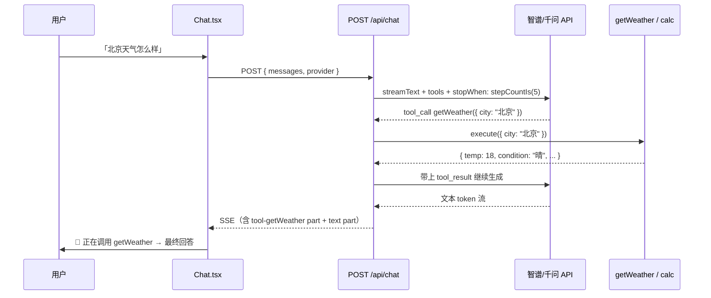
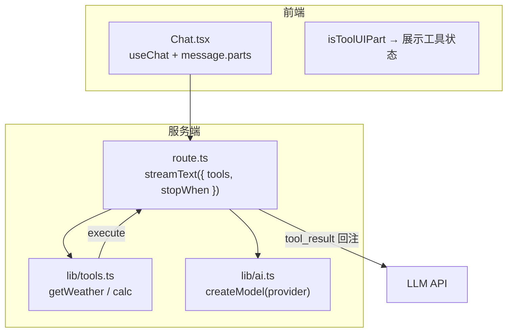

# Lab 04 Tool Calling 链路

## 界面预览

MCP 配置见 [mcp-servers.md](./mcp-servers.md#界面预览)。

## 时序图

## 架构

## 核心文件

| 文件 | 职责 |
|------|------|
| `lib/tools.ts` | 定义 `tool()` + `inputSchema` + `execute` |
| `route.ts` | `streamText({ tools, stopWhen: stepCountIs(5) })` |
| `Chat.tsx` | `isToolUIPart` 渲染工具调用状态 |

## 和 Lab 03 的变化

| Lab 03 | Lab 04 |
|--------|--------|
| 纯文本生成 | 模型可发起 `tool_call` |
| 单步 `streamText` | 多步循环：`stopWhen: stepCountIs(5)` |
| 只渲染 `text` part | 额外渲染 `tool-getWeather` / `tool-calc` part |

## AI SDK v7 要点

- 用 `inputSchema`（Zod），不是旧版 `parameters`
- 用 `stopWhen: stepCountIs(N)`，不是旧版 `maxSteps`
- 默认 `stopWhen` 是 `isStepCount(1)`——**只跑一步就停**，有 tool 时必须显式加大步数
- UI part 类型是 `tool-<toolName>`（如 `tool-getWeather`），用 `isToolUIPart` 判断

## 踩坑记录

- 不传 `stopWhen` 时，模型调完 tool 不会继续生成最终答案
- 智谱等小模型对 tool calling 支持因模型而异，`glm-4-flash` 一般可用
- `calc` 用安全白名单解析，不要用裸 `eval(expression)`

## 验收

- [ ] 问「北京天气」→ UI 出现 `getWeather` 调用 → 回答含温度/天气
- [ ] 问「计算 (12+8)*3」→ 触发 `calc` → 回答含 60
