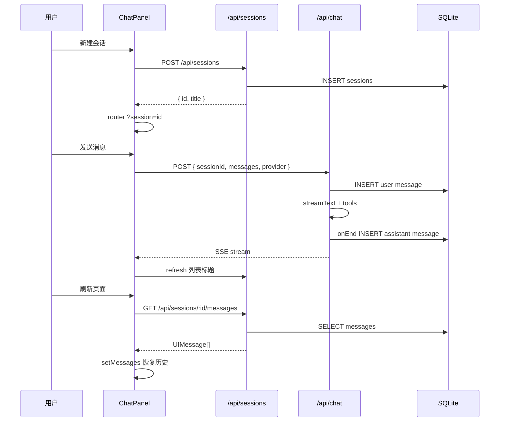
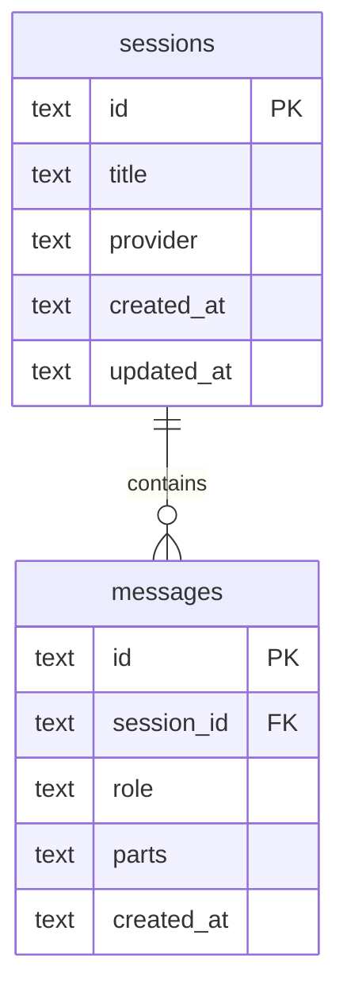

# Lab 05 会话持久化链路

## 时序图

## 表结构

## 核心文件

| 文件 | 职责 |
|------|------|
| `lib/db.ts` | SQLite 连接与建表 |
| `lib/sessions.ts` | sessions/messages CRUD |
| `app/api/sessions/route.ts` | 列表 / 新建 |
| `app/api/sessions/[id]/messages/route.ts` | 加载历史 |
| `app/api/chat/route.ts` | 流式对话 + 持久化 |
| `hooks/useSessions.ts` | 前端会话列表 |
| `components/shell/AppShell.tsx` | 左侧会话栏 |

## 和 Lab 04 的变化

| Lab 04 | Lab 05 |
|--------|--------|
| 内存态 `useChat` | SQLite 持久化 |
| 无会话概念 | `sessions` + 左侧列表 |
| 刷新丢历史 | `?session=` 深链接恢复 |

## 踩坑记录

- `useChat` 的 `id` 必须跟 `sessionId` 绑定，切换会话时要 `setMessages` 重载
- assistant 消息在 `toUIMessageStream.onEnd` 保存，不要只靠客户端 `onFinish`
- `better-sqlite3` 需允许 pnpm build script（`.npmrc` + `onlyBuiltDependencies`）
- Next.js 流式响应下服务端 `onEnd` 不稳定，需客户端 `useChat.onFinish` 再 POST 一次（`messageExists` 去重）

## 验收

- [ ] 新建会话 → 发消息 → 刷新 → 历史仍在
- [ ] 新建第二个会话 → 切换 → 各自历史独立
- [ ] 首条消息后会话标题从「新对话」变为消息摘要
